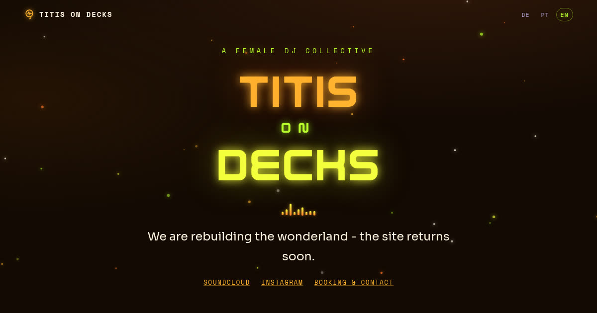
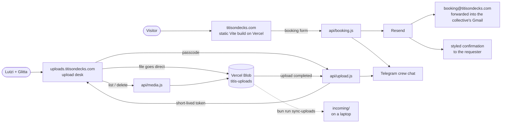

<p align="center">
  
</p>

<h1 align="center">TiTis on Decks</h1>

<p align="center">
  Website of <b>TiTis on Decks</b> - a female DJ collective by
  <a href="https://soundcloud.com/dielu">Lutzi</a> &amp; <a href="https://soundcloud.com/glittawicca">Glitta</a>.<br>
  <i>Different sounds. Different characters. One shared frequency.</i>
</p>

<p align="center">
  <a href="https://www.titisondecks.com"></a>
  <a href="https://soundcloud.com/titisondecks"></a>
  <a href="https://www.instagram.com/titis_on_decks/"></a>
</p>

<p align="center">
  <a href="https://react.dev"></a>
  <a href="https://vite.dev"></a>
  <a href="https://bun.sh"></a>
  <a href="https://motion.dev"></a>
  
  <a href="https://testing-library.com"></a>
  <br>
  <a href="https://vercel.com"></a>
  <a href="https://vercel.com/docs/vercel-blob"></a>
  <a href="https://resend.com"></a>
  <a href="https://core.telegram.org/bots"></a>
</p>

<p align="center">
  <a href="#pages">Pages</a> ·
  <a href="#the-curtain">The curtain</a> ·
  <a href="#how-it-fits-together">How it fits together</a> ·
  <a href="#booking-pipeline">Booking</a> ·
  <a href="#upload-desk">Upload desk</a> ·
  <a href="#design">Design</a> ·
  <a href="#structure">Structure</a> ·
  <a href="#run-it">Run it</a> ·
  <a href="#hosting">Hosting</a> ·
  <a href="DEVELOPER.md">Developer notes</a>
</p>

---

## Pages

| Route | What it is |
|-------|------------|
| `/` | The living site - warm blacklight (amber / UV yellow / acid green), EMOTIQ titles, real story and sets |
| `/pink` | The living site in the site's archived pink night palette - same page, other colors (legacy `#/pink` lands here) |
| `/radio` | Sunrise Radio, living - EMOTIQ, the transmissions grid, DJ filters, morning atmosphere (legacy `#/radio` lands here) |
| `/events` | Where the collective plays next - no photos of the nights, only the promoter's own flyer. Stands in front of the curtain |
| `/soon` | The curtain page - what the public domains show while the collective sorts things out |
| `/press` | The press kit (`public/press.pdf`) |
| `/carla` | The artist page, living, unlisted - a template for whoever gets one next |
| `/glitta` | Glitta's own page, living, unlisted - with Perplexico playing on a turntable |
| `/nubreed` | NU BREED, MULTIVERSE IV · Amazonia - a night that never happened, living, unlisted |
| `/joy` | "Celebrate Women! All of them!" - an homage, living, unlisted |
| `/love` | The warm twin of `/joy`, living, unlisted |
| `/pluribus` | *E pluribus unum* - the political one, living, unlisted |
| `uploads.titisondecks.com` | The [upload desk](#upload-desk) - a tool for the collective, not a page of the site |

<details>
<summary><b>Page notes</b> - what the unlisted pages are and why they are built the way they are</summary>

- **`/carla`** - The artist page, living, unlisted (nothing links to it; shared as a direct link). Carla Heinz does not exist: the name picks no side and neither does the hooded portrait, so the page can stand in for whoever gets one next without gendering them. Renders `sections/ArtistPage.jsx` with an `artist` prop - a template component rather than a one-off page. Six slots (kicker, name, portrait, caption, bio, note) plus an optional CTA; copy lives in the `carla` block of `translations.jsx`, portrait in `public/media/artists/`. Pink skin.
- **`/glitta`** - Glitta's own page - living, unlisted like `/carla`. Her featured-artist layout in the pink-purple night palette, with her SoundCloud linked from day one, and Perplexico - her track on One.Shared.Frequency. records - playing on a turntable further down the page.
- **`/nubreed`** - NU BREED, MULTIVERSE IV · Amazonia - a night that never happened, living, unlisted. Led by the *Anni, Amazon Warrior* visualiser (never autoplays - it carries a song), with the flyer one tap away. The flyer is generated from `scripts/flyer-nu-breed.html`; the page says outright that the night is fiction, and it is deliberately kept out of `eventsData.js` so the real dates pipeline never carries an invented one.
- **`/joy`** - "Celebrate Women! All of them!" - an homage, living, unlisted. Not a night and not a joke, so nothing on it is invented and nothing is borrowed: no flyer, no line-up, no embed and no photograph. The picture is drawn and it is the page's weather - seven volumes of coloured light behind the whole page (`components/Clouds.jsx`, cool palette), stacked with `mix-blend-mode: screen` so overlaps add and all seven make white, each drifting on its own 23-37s clock. A scrim of the page's own ground goes over the light and under the words, because screen-blended light under body text is a contrast problem that *moves*. Under it, eight of them named without numbers, because a numbered list of people is a ranking. Cool skin.
- **`/love`** - The warm twin, living, unlisted. Same construction in the Nu Breed register - warm skin, warm cloud palette - and leaner: `/joy` names them, this one says what the naming is for. Carries the page family's one raised voice, a line addressed to the chest-beaters, and the quiet correction under it that keeps the line about behaviour rather than about anybody's birth. Both halves are held by tests in all three languages, because either without the other changes what the page means.
- **`/pluribus`** - *E pluribus unum* - the political one, living, unlisted. Third of the family `/joy` and `/love` started, and the one that argues rather than celebrates: what a dance floor already knows about sharing a room, and - framed, because the page stands on it - what it is closed to. Its picture is a mosaic (`components/Mosaic.jsx`): 144 tiles, each its own hue laid out by the golden angle so no two neighbours match, masked to a disc. Step back, one thing; step in, a hundred and forty-four. Cool skin. Names no party on purpose - a rule catches the next one too, and a fun page that names sitting politicians becomes a liability somebody else has to defend.

</details>

Routing is a tiny router in `src/App.jsx`: hashes starting with `#/` switch
pages, the real paths `/pink` and `/radio` (`vercel.json` rewrites) are
living pages, and plain `#anchors` scroll within the current page. The
font is its own axis (`html[data-font]`): living pages and drafts 5-7
wear EMOTIQ, the earlier drafts keep Monoton.

### The curtain

While the collective sorts out photo rights, `titisondecks.com` and `www`
show only the curtain page (`/soon`). The full site stays reachable on the
staging domain, on `*.vercel.app` previews and on localhost. Two things
answer before the curtain: `/events`, because where the collective plays
next is the one thing the public needs meanwhile, and the upload desk on
its own subdomain. Reopening the site = set `CURTAIN` to `false` in
`src/App.jsx`, commit, push.

## How it fits together



## Booking pipeline

The booking section on the living pages posts to `api/booking.js` - a
Vercel serverless function (the `/api` folder deploys next to the static
build, no framework change). One request sends the collective a
notification mail with Reply-To set to the requester, a styled
confirmation to the requester in the site's language, and a Telegram
ping to the crew. Plain `fetch` throughout - zero dependencies.

Configured entirely through Vercel env vars (never in the repo):

| Var | What |
|-----|------|
| `RESEND_API_KEY` | required - the [Resend](https://resend.com) key that does the sending (a sending-only key is enough) |
| `BOOKING_TO` | recipient - `booking@titisondecks.com`, the live brand address, forwarding into the collective's Gmail |
| `BOOKING_FROM` | `TiTis on Decks <booking@titisondecks.com>` - the domain is verified at Resend. Without it the function falls back to Resend's onboarding sender, which only delivers to the account owner |
| `TELEGRAM_BOT_TOKEN` | optional - bot token from @BotFather |
| `TELEGRAM_CHAT_IDS` | optional - comma-separated chat ids to ping |

Until `RESEND_API_KEY` + `BOOKING_TO` exist the function answers 503 and
the form falls back to a prefilled mail draft to the address in
`src/contact.js` - a request never dead-ends.

## Upload desk

`uploads.titisondecks.com` is where Lutzi and Glitta drop photos, video
loops and sets straight into Vercel Blob from the browser. The file never
travels through a function: a serverless request body caps out at 4.5 MB
and a two-hour set is ten times that. Instead the page asks
`api/upload.js` for a short-lived upload token, then talks to Blob
directly.

- `api/upload.js` checks the shared passcode before handing out a token,
  pins down what may be uploaded (type + size, up to 1 GB), and pings the
  crew on Telegram once a file has landed.
- `api/media.js` is the desk's back office - list and delete, gated on the
  same word. Everything is POST, including the read, so the word never
  lands in an access log or a browser history entry.

| Var | What |
|-----|------|
| `UPLOAD_PASSCODE` | required - the shared word typed on the desk |
| `BLOB_READ_WRITE_TOKEN` | injected automatically by the linked `titis-uploads` store - nothing to set by hand |
| `TELEGRAM_BOT_TOKEN` / `TELEGRAM_CHAT_IDS` | optional - reused from the booking pipeline |

To bring uploads home, `bun run sync-uploads` copies everything in the
store that is not already on disk into `incoming/` (gitignored, never
under `public/`). Nothing is overwritten or deleted - the keepers get
optimised into `public/media/photos/` by hand. It needs
`BLOB_READ_WRITE_TOKEN`, e.g. from
`vercel env pull .env.local --environment production`.

## Design

- **Theme scoping:** the home page's warm palette lives in `src/styles/home.css`,
  guarded by `html[data-theme='home']`. `src/styles/site.css` holds the site's
  earlier, archived design and stays untouched - frozen on purpose.
- **Type:** EMOTIQ (display titles on the living pages: hero, finale, Sunrise
  Radio - demo cut from the collective, full license pending), Monoton
  (the archived design's neon display), Sora (body), Space Mono
  (labels/data). All embedded as data URIs in `src/styles/fonts.css` - no
  external requests.
- **Motion:** React + [motion](https://motion.dev). Ingredients: `SplitText`
  (neon flicker-on), `ShinyText` (light sweep), `TiltCard` (pointer tilt +
  glare), `Spores` (canvas drift, warm colors via prop), `Waveform` (the
  logo's waveform as a living equalizer). Everything respects
  `prefers-reduced-motion`.

## Structure

```
index.html                   Vite entry (real logo favicon from public/icon.png)
src/App.jsx                  router, the curtain, data-theme switching
src/home/                    the real site: Nav · Hero · Collective · Story ·
                             Spectrum · Sound · Gathering · Gallery · Booking ·
                             Finale (+ sets.js / media.js data modules)
src/sections/                the other pages - Radio, Events, Soon, the upload
                             Desk, the artist page and the homage family
src/components/              animation ingredients
src/i18n/                    DE / PT / EN - DE and PT lead, EN is fallback
src/styles/                  fonts.css (embedded fonts) · home.css · site.css (frozen)
api/booking.js               booking function (see Booking pipeline)
api/upload.js, api/media.js  upload desk functions (see Upload desk)
public/media/                real photos & video loops from the collective
scripts/build-og-pages.mjs   per-route link previews (runs after vite build)
scripts/sync-uploads.mjs     brings desk uploads down into incoming/
tests/                       bun test suites (jsdom preload in tests/setup.js)
vercel.json                  rewrites, host rules for uploads + staging, Bun 1.4 runtime
```

### Link previews

An unfurler reads the HTML and never runs the router, so on a client-side
site every path previews as whatever is in `index.html` - the home card,
no matter which page you shared. `bun run build` therefore runs
`scripts/build-og-pages.mjs` after Vite, which copies `dist/index.html`
per route with the social tags swapped, and `vercel.json` points that
route at its own file (`/nubreed` → `/nubreed.html`). Same bundle, same
router; only the `<head>` differs.

**To give a new route its own card:** add an entry to `PAGES` in that
script, point its `vercel.json` rewrite at `<route>.html`, and drop a
1200×630 image in `public/media/` (compose it like
`scripts/og-nu-breed.html` and screenshot it headless). Every swap asserts
it matched exactly once, so a tag that stops matching fails the build
instead of shipping the wrong card.

The tab title still comes from `i18n/meta.title` at runtime, so a page
with its own card still shows the site-wide title once the app boots.

## Run it

```sh
bun install
bun run dev           # local dev server
bun run build         # static build in dist/
bun run test          # bun test --isolate - Bun's own test runner
bun run sync-uploads  # bring desk uploads down into incoming/
```

`bun.lock` is the only lockfile. `dev`, `build`, `preview` and now `test` all run on Bun's own
runtime (`bun --bun vite`, `bun test --isolate`), which for the build emits a byte-identical
bundle to Node's. Production runs Bun as well - `vercel.json` pins `bunVersion` to `1.4.x`, so the
serverless functions in `api/` execute on Bun rather than Node. `package.json` carries the
same floor as `engines.bun` (`>=1.4.0`), so a contributor's Bun and the one Vercel builds
with cannot silently disagree - 1.4 is an explicit opt-in on Vercel's side and carries
breaking changes, which is exactly why the two are written down together.

Working on the code? Start with [DEVELOPER.md](DEVELOPER.md) - routing, common tasks, env vars and tests in one place.

## Hosting

The site lives in the collective's own Vercel account, Git-connected to
this repository: a push to `main` deploys production, every other branch
gets a preview URL. The domain's DNS is at Namecheap - the website
records point at Vercel, `booking@` forwards through ImprovMX into the
collective's Gmail, and Resend's DKIM record lets the site send as
`booking@titisondecks.com`.

## Placeholders to replace

- Booking now goes to `booking@titisondecks.com`, live and forwarding into
  the collective's Gmail - `src/contact.js` and the `BOOKING_TO` env var
  both point there. The draft backups keep the frozen
  `hello@titisondecks.example` on purpose.
- The *Next gathering* timetable is the wonderland placeholder until real dates exist
- EMOTIQ ships as the demo cut (© Enxyclo Studio) - buy the full license before
  the site is promoted commercially

---

<p align="center"><sub>like what you see? pm me - <a href="https://github.com/2701kai">2701kai</a> (<a href="https://wa.me/491711009293">WhatsApp</a>)</sub></p>
